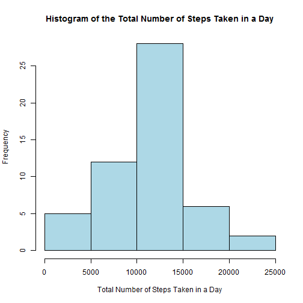

# Reproducible Research: Peer Assessment 1

## Loading and preprocessing the data

```r
PA1RR <- read.csv("~/Classes/MOOC/Johns Hopkins Course Materials/Reproducible Research/Data/activity.csv")
str(PA1RR)
```

```
## 'data.frame':	17568 obs. of  3 variables:
##  $ steps   : int  NA NA NA NA NA NA NA NA NA NA ...
##  $ date    : Factor w/ 61 levels "2012-10-01","2012-10-02",..: 1 1 1 1 1 1 1 1 1 1 ...
##  $ interval: int  0 5 10 15 20 25 30 35 40 45 ...
```

## What is mean total number of steps taken per day?

First aggregate the data

```r
PA1stepsum <- aggregate(steps~date,PA1RR,sum)
head(PA1stepsum)
```

```
##         date steps
## 1 2012-10-02   126
## 2 2012-10-03 11352
## 3 2012-10-04 12116
## 4 2012-10-05 13294
## 5 2012-10-06 15420
## 6 2012-10-07 11015
```
`1.` Histogram of the total number of steps taken in a day


```r
hist(PA1stepsum$steps,xlab="Total Number of Steps Taken in a Day",
     main="Histogram of the Total Number of Steps Taken in a Day",
     col="light blue")
```

 

`2.` The mean umber of steps taken per day is 1.0766 &times; 10<sup>4</sup> and the median is 10765.  The code used for these in line commands was  

```
mean(PA1stepsum$steps)  
median(PA1stepsum$steps)
```

## What is the average daily activity pattern?

Get the data in the proper form


```r
PA1stepave <- aggregate(steps~interval,PA1RR,mean)
head(PA1stepave)
```

```
##   interval   steps
## 1        0 1.71698
## 2        5 0.33962
## 3       10 0.13208
## 4       15 0.15094
## 5       20 0.07547
## 6       25 2.09434
```

`1.`  Time series plot


```r
plot(steps~interval,PA1stepave,type="l",xlab="Interval",ylab="Average Number of Steps",
     main="Average Number of Steps Per Day for Each Interval")
```

 

`2.` The interval with the largest average number of steps is 835.  The code used for this is  
```
PA1stepave$interval[which.max(PA1stepave$steps)]
```
## Imputing missing values

`1.` The total number of missing values in the data set is 2304.


```r
library(Hmisc)
describe(PA1RR)
```

```
## PA1RR 
## 
##  3  Variables      17568  Observations
## ---------------------------------------------------------------------------
## steps 
##       n missing  unique    Mean     .05     .10     .25     .50     .75 
##   15264    2304     617   37.38     0.0     0.0     0.0     0.0    12.0 
##     .90     .95 
##    86.0   252.8 
## 
## lowest :   0   1   2   3   4, highest: 786 789 794 802 806 
## ---------------------------------------------------------------------------
## date 
##       n missing  unique 
##   17568       0      61 
## 
## lowest : 2012-10-01 2012-10-02 2012-10-03 2012-10-04 2012-10-05
## highest: 2012-11-26 2012-11-27 2012-11-28 2012-11-29 2012-11-30 
## ---------------------------------------------------------------------------
## interval 
##       n missing  unique    Mean     .05     .10     .25     .50     .75 
##   17568       0     288    1178   110.0   220.0   588.8  1177.5  1766.2 
##     .90     .95 
##  2135.0  2245.0 
## 
## lowest :    0    5   10   15   20, highest: 2335 2340 2345 2350 2355 
## ---------------------------------------------------------------------------
```


`2.` Will impute the values using the mean for the corresponding interval across all days.  

`3.` We will augment our data frame with a column indicated the imputed value and then will be have another column with the potential imputed value.  

```r
# Create an Imputed column
PA1RRimpute=cbind(PA1RR,Imputed=is.na(PA1RR$steps))
# Merge to get the interval averaged values
PA1RRimpute=merge(PA1RRimpute,PA1stepave,by=c("interval"))
# Place imputed values in
PA1RRimpute$steps.x[PA1RRimpute$Imputed]<-PA1RRimpute$steps.y[PA1RRimpute$Imputed]
# Sort the data back into its original form
PA1RRimpute <- PA1RRimpute[order(PA1RRimpute$date,PA1RRimpute$interval),]
# Clean up
names(PA1RRimpute)[2]="steps"
```


`4.` Histogram

```r
PA1stepsumimpute <- aggregate(steps~date,PA1RRimpute,sum)
```


```r
hist(PA1stepsumimpute$steps,xlab="Total Number of Steps Taken in a Day (Imputed Values)",
     main="Histogram of the Total Number of Steps Taken in a Day",
     col="light blue")
```

 

The mean and median total number of steps taken per day. day is 1.0766 &times; 10<sup>4</sup> and the median is 1.0766 &times; 10<sup>4</sup>.  The code used for these in line commands was  

```
mean(PA1stepsumimpute$steps)  
median(PA1stepsumimpute$steps)
```

The imputing made little change in the mean and median, in fact the mean is unchanged and the median is only slightly larger.  

## Are there differences in activity patterns between weekdays and weekends?

First, we must get the data in a form we can use.  We will create a new column with the weekday in it.  


```r
PA1RRimpute <- cbind(PA1RRimpute,Weekday=weekdays(as.Date(PA1RRimpute$date)))
```

`1.` Now create the Weekday/Weekend variable


```r
PA1RRimpute <- cbind(PA1RRimpute,
        Work=ifelse(PA1RRimpute$Weekday%in%c("Saturday","Sunday"),"Weekend","Weekday"))
```

`2.` Make a panel plot containing a time series plot (i.e. type = "l") of the 5-minute interval (x-axis) and the average number of steps taken, averaged across all weekday days or weekend days (y-axis).

Load lattice and then aggregate data.


```r
library(lattice)
PA1stepaveWork <- aggregate(steps~interval:Work,PA1RRimpute,mean)
head(PA1stepaveWork)
```

```
##   interval    Work   steps
## 1        0 Weekday 2.25115
## 2        5 Weekday 0.44528
## 3       10 Weekday 0.17317
## 4       15 Weekday 0.19790
## 5       20 Weekday 0.09895
## 6       25 Weekday 1.59036
```


```r
xyplot(steps~interval|Work,PA1stepaveWork,type="l",
       xlab="Interval",ylab="Average Number of Steps",
     main="Average Number of Steps Per Day for Each Interval by Work Week",
     layout=c(1,2))
```

 


